# Module-18-Challenge

## Background

The Citibike website provides two types of dataset: one that covers all Citibike data and the other focuses on Jersey City data. Due to file size constraints on Tableau and Github, my analysis focuses on Jeresy City data from January 2019 to December 2020. This two-year timeframe was selected to discover potential impacts of COVID-19 on Citibike usage.

Since the CDC reported the first COVID-19 confirmed case in the United States on January 20, 2020, analyzing data from 2019 to 2020 allows us to explore potential shift in Citibike usage and user behavior related to the pandemic.

## Analysis Topics

- Was there a shift in Citibike user gender and age?

- Were there changes in the proportions of Citibike subscriber and non-subscriber?

- How did the pandemic impact Citibike's monthly usage?

- Which days of the week and hours of the day were most popular before and during the pandemic?

- What were the top 10 stations in Jersey City for starting and ending a ride before and during the pandemic?

## Data Extraction and Data Transformation

- I downloaded monthly Citibike CSV files for the year 2019 and 2020, and stored them in the `Raw_Data` folder.

- Read each monthly CSV file using the Pandas library and combined them into yearly dataframes for 2019 and 2020.
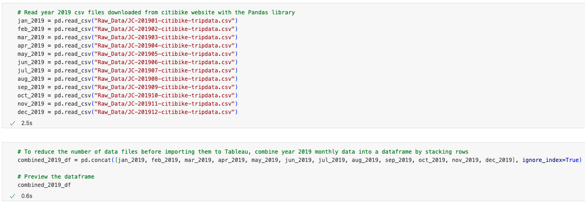
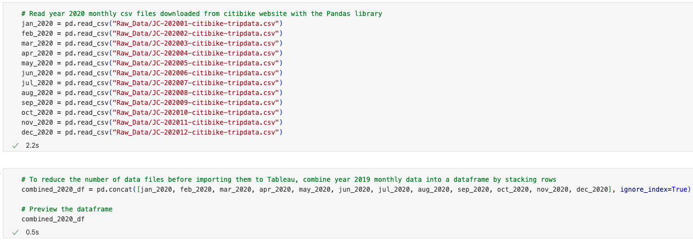

- For age analysis, I calculated each user's age based on the `birth year` column, then added an `age` column to store these values in each yearly dataframe.
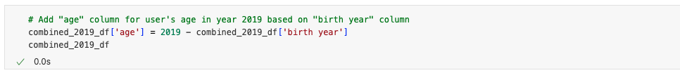
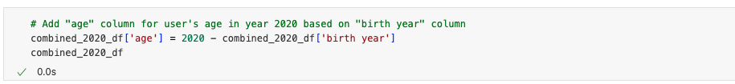

- Merged the 2019 and 2020 dataframes into a single dataframe.
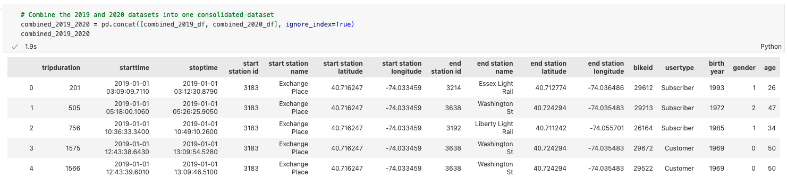

- Transformed the numeric values in the `gender` column into `unknown`, `male`, and `female` so I don't need to revise the labels in Tableau.
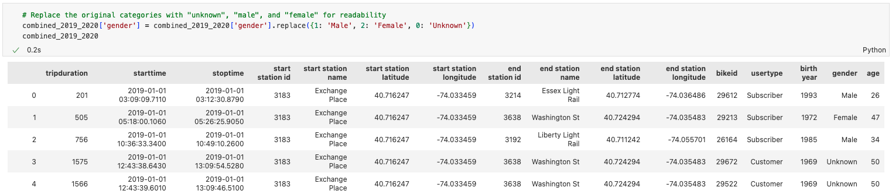

- Finally, I saved the transformed dataframe as a CSV file in the `Resource_Tableau` folder for use in Tableau. **Please note that the final consolidated CSV file size is 135MB, which exceeds GitHub's indicidual file size limit. As a result, this file wasn't uploaded to the respository. However, the code used to generate it is displayed in the screenshot below.**
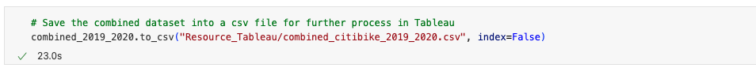

- During data transforming process, I identified potential data entry errors in the `birth year` column, with 218 entries showing ages over 100 years. To maintain accuracy and avoid ambiguity, I excluded rows with ages over 90 or unknown gender when analyzing user age and gender distributions.
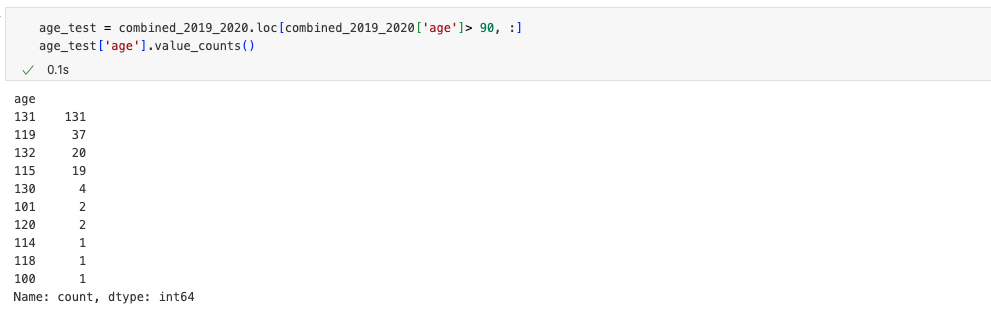

## Analysis

Maps, visualizations, and analysis are all included in the [Tableau Story](https://public.tableau.com/app/profile/yen.lu3931/viz/CitibikeAnalysis_17314242469970/Story1) to meet this challenge's requirements. Followings are the screenshots of the tableau story I created for your reference:

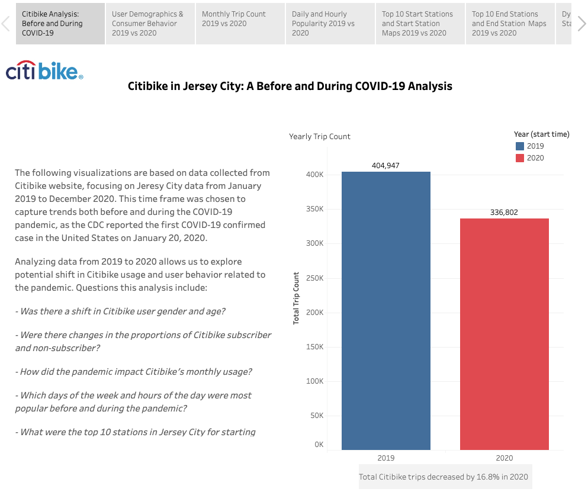

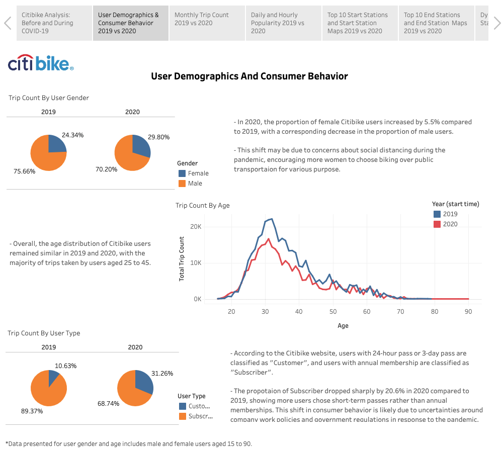

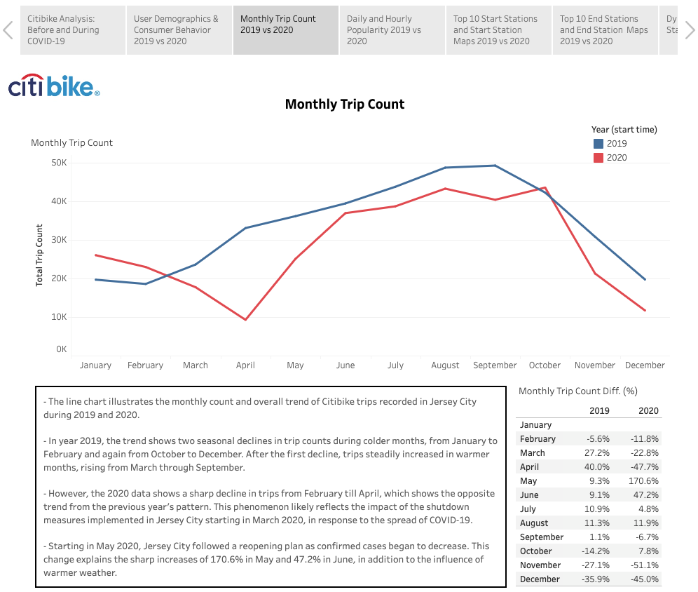

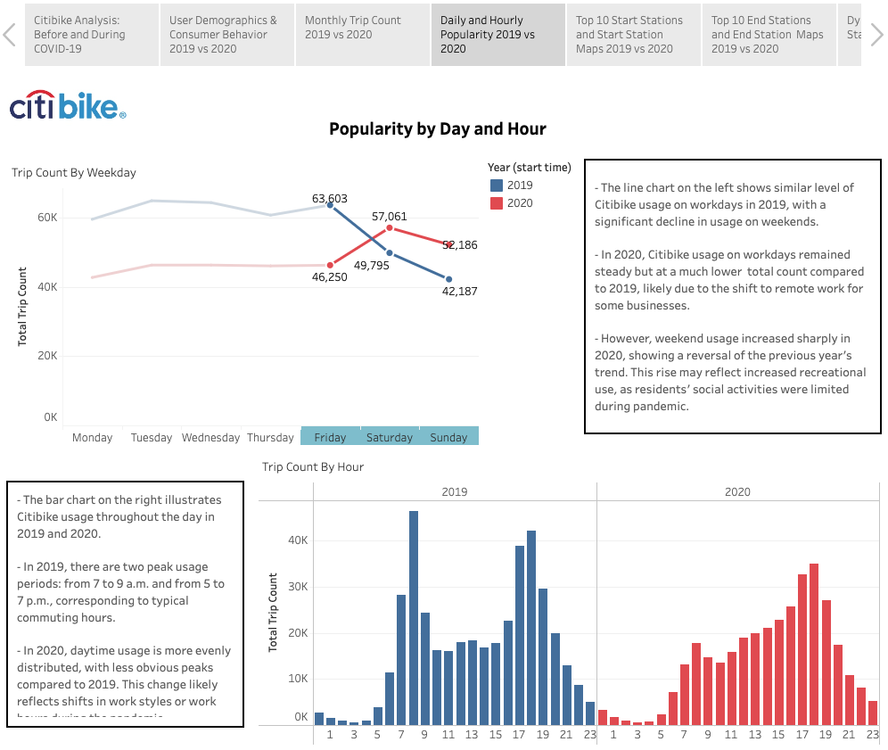

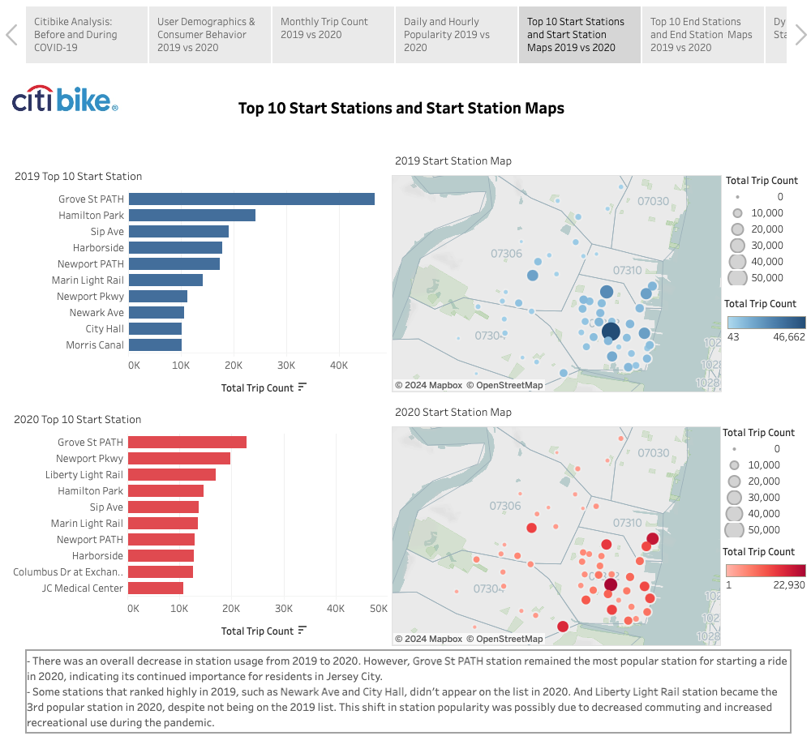

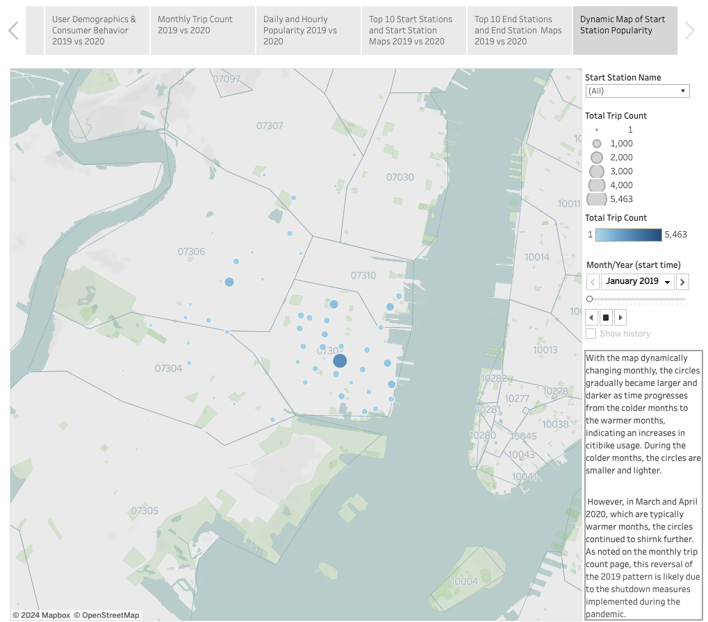

## Resources

Resources that I referred to for completing this homework:

<https://chatgpt.com/>

<https://citibikenyc.com/system-data>

<https://www.nga.org/coronavirus-state-actions/new-jersey/>
